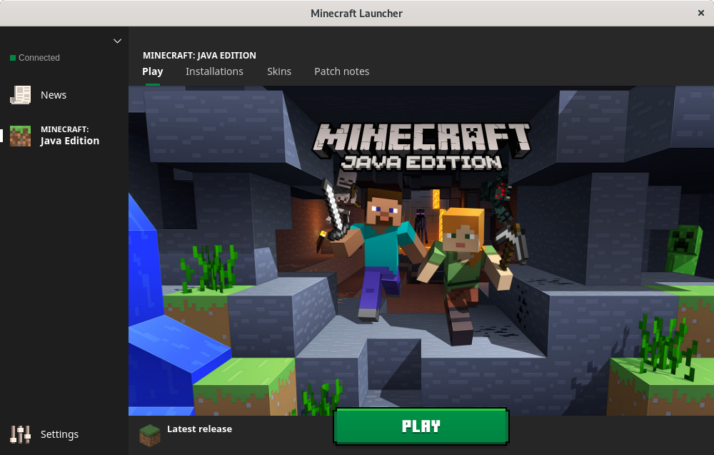
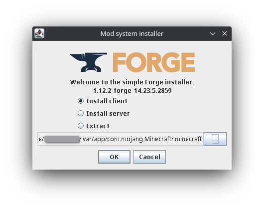

# Minecraft (Flatpak)

Welcome to the [FlatHub distribution of Minecraft](https://flathub.org/apps/details/com.mojang.Minecraft). To get started, as customary for the installation of any FlatHub app, make sure to follow the [setup guide](https://flatpak.org/setup/) before installing using `flatpak install flathub com.mojang.Minecraft`.

## Usage Notes

For non-vanilla Minecraft players, please read these important usage notes.

#### Resource Packs, Modifications, etc.

If you want to use various resource packs or modifications (mods), you can transfer the resources (typically `.jar` files) to `~/.var/app/com.mojang.Minecraft/.minecraft`.

#### Minecraft Forge

A common way to use Minecraft resource packs and modifications is through Minecraft Forge. Essentially, Forge will act as an entire Minecraft instance that you will launch. Each Minecraft Forge instance is versioned similarly to regular Minecraft instances (e.g. one instance for Forge 1.7.10, another instance for Forge 1.15.2). Note that each Forge version corresponds to a regular Minecraft instance of that version, only modded to allow for easy resource pack and mod installations.

To install, download a version of Minecraft Forge from their [official website](https://files.minecraftforge.net/net/minecraftforge/forge/). This will be a `.jar` file. Once you download the `.jar` file, open the shell and execute `java -jar /path/to/your/download/location/forge.jar`. This will launch the forge installation window. There, navigate to `~/.var/app/com.mojang.Minecraft/.minecraft` and click "OK" (screenshot shown below).

Now, when you reboot the `com.mojang.Minecraft` launcher, you will see a new Minecraft listed clearly with "Forge" and the version number you installed. Happy modding!

## Disclaimer

Please note that this wrapper is not verified by, affiliated with, or supported by Mojang or Minecraft.
